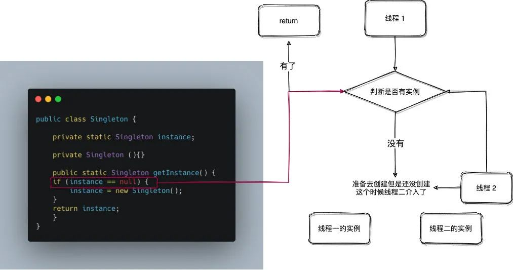

```yaml
多个线程去调用getInstance方法来获取Singleton的实例，可能会发生这样的情况:
  
线程一在执行if（instance==null）时，此时instance是为null的进入语句。

在还没有执行instance=new Singleton()时（此时instance是为null的）第二个线程也进入了if(instance==null)这个语句。

因为之前进入这个语句的线程中还没有执行instance=new Singleton()，所以它会执行instance = new Singleton()来实例化Singleton对象。

因为第二个线程也进入了if语句所以它会实例化Singleton对象，这样就导致了实例化了两个Singleton对象
```