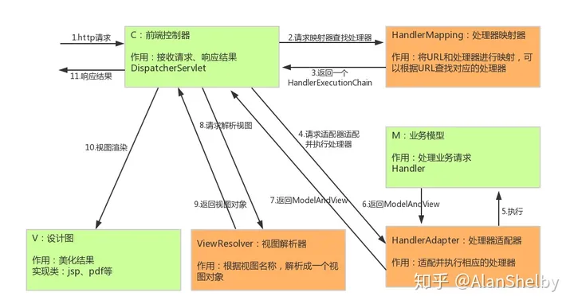

- 用户发送请求至前端控制器 DispatcherServlet。

- DispatcherServlet 收到请求调用 HandlerMapping 处理器映射器。

- 处理器映射器根据请求 url 找到具体的处理器，生成处理器对象及处理器拦截器（如果有则生成）一并返回给 DispatcherServlet。

- DispatcherServlet 通过 HandlerAdapter 处理器适配器调用处理器。

- HandlerAdapter 执行处理器（handler，也叫后端控制器）。

- Controller 执行完成返回 ModelAndView。

- HandlerAdapter 将 handler 执行结果 ModelAndView 返回给 DispatcherServlet。

- DispatcherServlet 将 ModelAndView 传给 ViewReslover 视图解析器。

- ViewReslover 解析后返回具体 View 对象。

- DispatcherServlet 对 View 进行渲染视图（即将模型数据填充至视图中）。

- DispatcherServlet 响应用户。