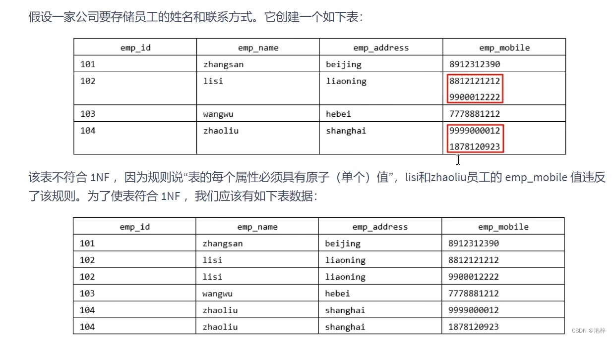
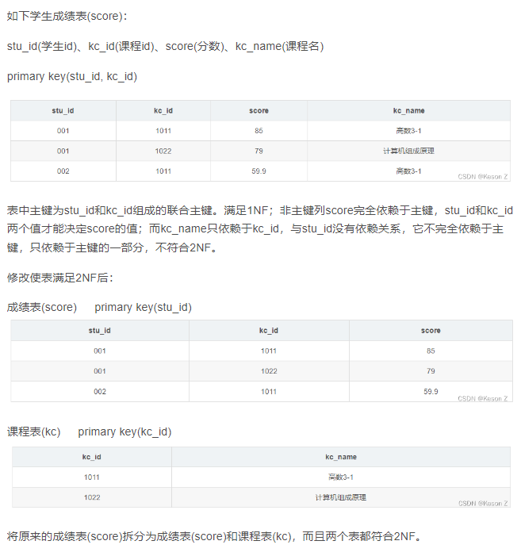
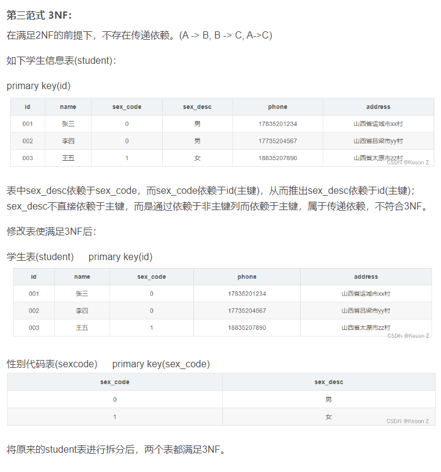

范式在数据库设计中是一个重要的概念。范式是一组规则，用于指导数据库中数据的组织方式，以确保数据的完整性和一致性。

1. 第一范式(1NF)

   第一范式要求数据库表中的每个列都是原子的，即每个列都不可再分。它消除了重复的数据，并确保每个列只包含一个值。如果一个表不符合第一范式，就需要对其进行拆分，将重复的数据移到单独的表中。

2. 第二范式(2NF)

   第二范式在满足第一范式的基础上，要求每个非主键列完全依赖于主键。换句话说，如果一个表中存在复合主键（由多个列组成），那么非主键列必须依赖于这个复合主键的所有列，而不是只依赖于其中一部分。如果存在部分依赖，就需要将相关的列拆分到新的表中，以确保每个非主键列只依赖于完整的主键。

3. 第三范式(3NF)

   第三范式在满足第二范式的基础上，要求每个非主键列之间不存在传递依赖。传递依赖指的是，如果A依赖于B，B又依赖于C，那么A和C之间存在传递依赖。为了消除传递依赖，需要将依赖关系不完整的列拆分到新的表中，以确保每个非主键列只依赖于主键或其他非主键列。

