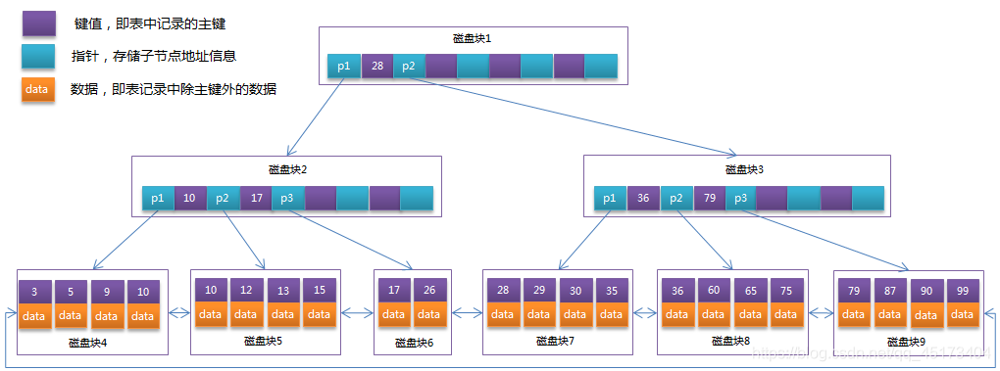
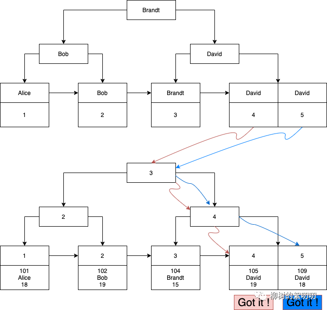

###### 1.什么是索引

- 官方定义：一种帮助mysql提高查询效率的数据结构

    - 优点：大大加快数据查询速度


- 缺点:

    - 维护索引需要耗费数据库资源

    - 索引需要占用磁盘空间

    - 当对表的数据进行增删改的时候，因为要维护索引，速度会受到影响

      (会导致底层数据结构变化,需要进行重排序;所以一般只在常用的搜索字段上建立索引)

###### 2.索引分类

- 主键索引：设定为主键后数据库会自动建立索引(innodb为聚簇索引)
- 普通索引：给表中的某一个列创建索引，即一个索引只包含单个列；一个表可以有多个单列索引
- 唯一索引：索引列的值必须唯一，但允许有空值(主键索引不允许索引列=null,唯一索引允许为null,但只能有一个null)
- 复合索引：基于表中的多个列共同创建一个索引，即一个索引包含多个列
- 全文索引：全文索引类型为FULLTEXT，在定义索引的列上支持值的全文查找，允许在这些索引列中插入重复值和空值。

###### 3.索引底层

- mysql底层为主键id自动创建索引，默认会对主键索引进行排序
    - 排序之后可以加快查询速度，如查询id=3的我只需要按照顺序找到3就行了
    - mysql主键采用int类型就是为了排序，因此mysql主键通常不采用uuid，是因为离散不好排序

- 基于B+树的索引结构—innoDB存储引擎



```yml
- B树节点中不仅存了数据的key值，还有data值
而每一个页的存储空间是有限的(16KB)，如果data数据较大时将会导致一个页能存储的key的数量很小，当存储的数据量很大时同样会导致B-Tree的深度较大，增大查询时的磁盘I/O次数，进而影响查询效率

- B+树只有叶子结点存放数据的data值，非叶子节点上只存储key值信息；且所有叶子节点之间都有一个链指针
在B+树中，所有数据记录节点都是按照键值大小顺序存放在同一层的叶子节点上，而非叶子节点上只存储key值信息，这样可以大大加大每个节点存储的key值数量，降低B+Tree的高度
```

###### 4.聚簇索引和非聚簇索引

- 聚簇索引和非聚簇索引都是采用B+树作为数据结构存储
    - 聚簇索引：将数据存储于索引放在一块，并且是按照一定的顺序组织的，找到了索引也就找到了对应的数据，数据的物理存放位置与索引顺序是一致的，即只要索引是相邻的，那么对应的数据也一定是相邻存储在磁盘上
    - 非聚簇索引：又称辅助索引。叶子结点不存放数据，存储的是数据行地址，也就是说根据索引查找到的数据行的位置再到磁盘中找到数据，就类似于书目录，我们要找第三章第一节，首先会去目录获取页码再去指定页码寻找



```
# 聚簇索引的优势
1. 查询通过聚簇索引可以直接获得数据,相比非聚簇索引二次查询效率更高(非覆盖索引情况下)
2. 聚簇索引对于范围查询的效率高,因为数据是按照大小排列的,适合用于排序的场合

# 聚簇索引的劣势
1. 维护索引很昂贵,特别插入新行或者主键更新导致分页时,由于保证有序,就必须移动行数据,此时可能会造成碎片
2. 数据表如果使用UUID作为主键,会使数据存储稀疏,会出现聚簇索引查询可能比全表扫描还慢,建议使用自增int类型作为主键
3. 如果主键很大,那辅助键索引会变的更大,会导致非叶子结点占用更多的物理空间,因为辅助索引的叶子存储的是主键值
```

- `InnoDB`与`MyISAM`的中索引的区别：
    - InnoDB聚簇索引默认是主键，如果表中没有定义主键，InnoDB会选择一个唯一且非空的索引代替。如果没有这样的索引，InnoDB
      会隐式定义一个主键（类似oracle中的RowId）来作为聚簇索引。如果已经设置了主键为聚簇索引又希望再单独设置聚簇索引，必须先删除主键，然后添加我们想要的聚簇索引，最后恢复设置主键即可。
    -
  MyISAM使用的是非聚簇索引，非聚簇索引的B+树与聚簇索引的B+树节点的结构完全一致，只是存储的内容不同而已，主键索引B+树的节点存储了主键，辅助键索引B+树存储了辅助键。表数据存储在独立的地方，这两颗B+树的叶子节点都使用一个地址指向真正的表数据，对于表数据来说，这两个键没有任何差别。由于索引树是独立的，通过辅助键检索无需访问主键的索引树。

###### 5.mysql当中的索引

```
索引的数据结构和具体存储引擎的实现有关，在MySQL中使用较多的索引有Hash索引，B+树索引等，InnoDB存储引擎的默认索引实现为：B+树索引。对于哈希索引来说，底层的数据结构就是哈希表，因此在绝大多数需求为单条记录查询的时候，可以选择哈希索引，查询性能最快；其余大部分场景，建议选择B+Tree索引
```

###### 6.索引设计原则

> 查询更快、占用空间更小

```
1.适合索引的列是出现在where子句中的列，或者连接子句中指定的列
2.基数较小的表，索引效果较差，没有必要在此列建立索引
3.使用短索引，如果对长字符串列进行索引，应该指定一个前缀长度，这样能够节省大量索引空间，如果搜索词超过索引前缀长度，则使用索引排除不匹配的行，然后检查其余行是否可能匹配
4.不要过度索引。索引需要额外的磁盘空间，并降低写操作的性能。在修改表內容的时候，索引会进行更新甚至重构，索引列越多，这个时间就会越长。所以只保持需要的索引有利于查询即可
5.定义有外键的数据列一定要建立索引
6.更新频繁字段不适合创建索
7.若是不能有效区分数据的列不适合做索引列（如性别，男女未知，最多也就三种，区分度实在太低）
8.尽量的扩展索引，不要新建索引。比如表中已经有a的索引，现在要加(a,b)的索引，那么只需要修改原来的索引即可
9.对于那些查询中很少涉及的列，重复值比较多的列不要建立索引
10.对于定义为text、image和bit的数据类型的列不要建立索引
```